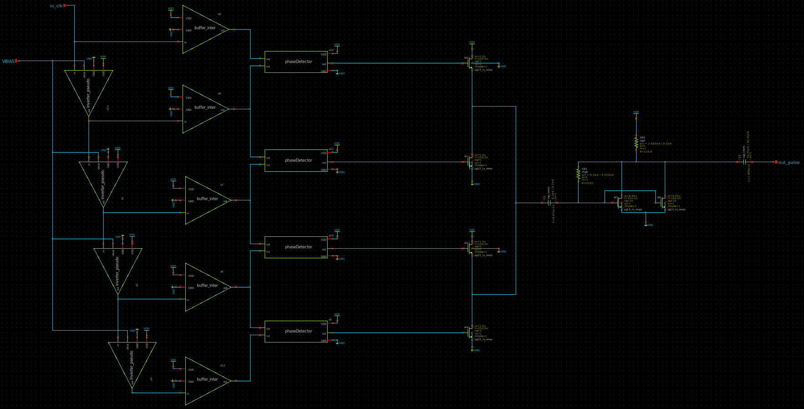
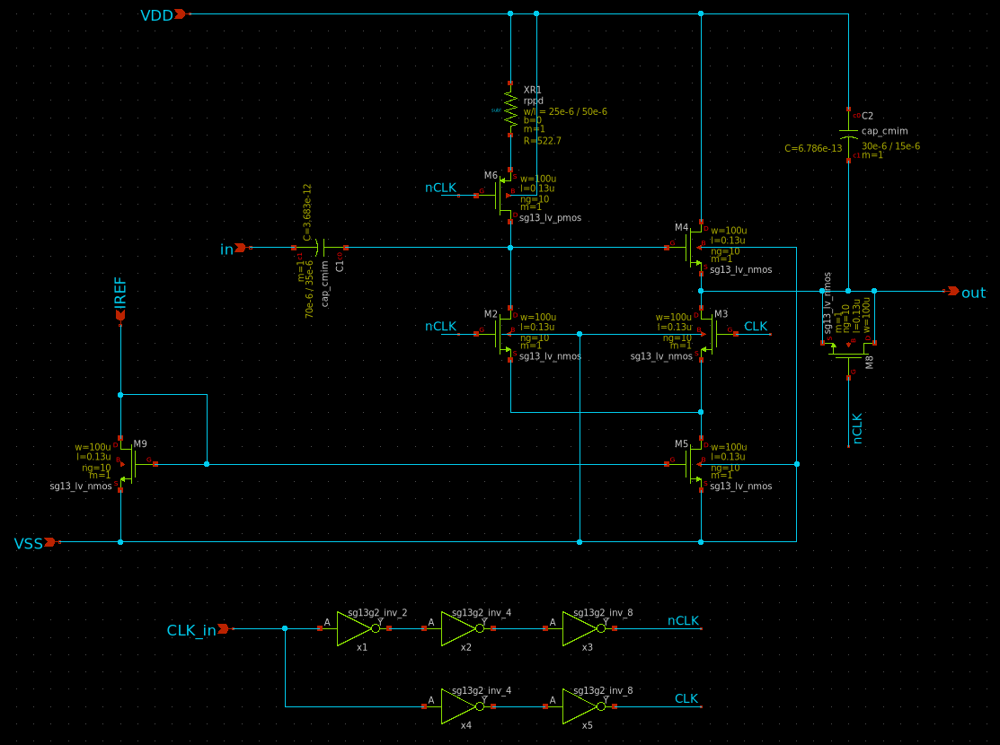

Specification of the Main Blocks
###################################

UWB Pulse Generator
=============================

In this submission, a Ultra-Wideband (UWB) 5th derivative Gaussian Pulse Generator is proposed, using a compact Phase Detector (PD) designed with dynamic n-blocks and n-latches, and a delay circuit based on a modified pseudo-nMOS inverter architecture. We have chosen this configuration because it presents a good delay response, making possible a better output pulse frequency. The PD circuit compares the phase difference of both input signals, and gives an output pulse proportional to the phase difference. The pulse shaping circuit implemented with NMOS transistors uses a RC circuit to generate the 5th derivative. This design is based on the paper intitled "A 5th derivative Gaussian pulse CMOS IR-UWB generator using a Phase Detector".

Track-and-Hold Amplifier
=============================

On the other hand, a Track-and-Hold Amplifier (THA) circuit based on a well known source follower stage is designed. This circuit samples one point of the UWB high frequency signal in each pulse, whenever it is in track mode. Its design consists of a circuit capable of operating at high frequencies, to turn track into hold mode as fast as possible. This design is based on the paper intitled "High-Speed Sampler for UWB Breast Cancer Detection System".

