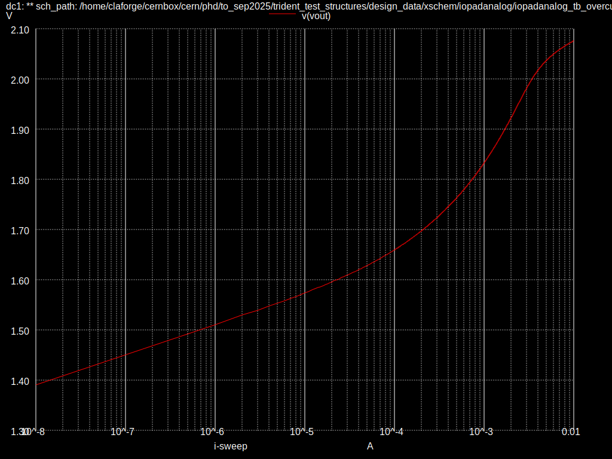

# IOPadAnalog

Here are simulations made on the IOPadAnalog provided by the IHP open pdk.
The goal is to give metrics to which the IOPadAnalogGuardLayer can be compared
to.

It is worth noting that the implementation of the first stage ESD diodes in the
IOPadAnalog spice model differs slightly from the one provided by the diodevdd_4k
and diodevss_4k, which should be equal. For this reason, the simulations
made in IOPadAnalogGuardLayer may have a slight edge. A ticket will be raised
on the IHP open pdk issue tracker.

## +1500V HBM

For an HBM event with charging voltage of 1500V, capacitance of 100pF
and series resistance of 330 ohms, the IHP provided IOPadAnalog in these conditions
result in 2.9V peak.

## -1500V HBM

For an HBM event with charging voltage of -1500V, capacitance of 100pF
and series resistance of 330 ohms, the IHP provided IOPadAnalog in these conditions
result in -3.29V peak.

## Over-current

A classic error while testing chips of this category is to source or sink a current
when the input is not stabilized. It is a great advantage to be able to sustain
the maximum current of the expected range without damage, even when the internal
circuitry does not work as expected.

