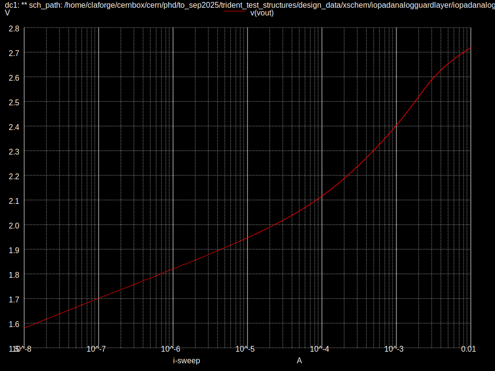

# IOPadAnalogGuardLayer

Here is an attempt at implementing a fully guarded analog IO ESD protection circuit for use
in ultralow current measurement. The ultimate target is to have as low leakage as possible,
while maintaining reasonable ESD protection and area usage.

This is done by implementing an extra layer of ESD protection all around the input of interest:

Due to time constraints and for characterization, no buffer will be implemented.

The main problem of this approach is that the ESD current has to
go through more devices, resulting in either poorer ESD protection, or
more area usage to essentially halve the dynamic resistance of all devices.

The goal of the present pad is to provide a fully guarded pad that can fit in
a standard cell with "best effort" ESD protection.

## +1500V HBM

Here is a table summarizing the peak voltage for an HBM event with charging voltage of 1500V, capacitance of 100pF
and series resistance of 330 ohms. The IHP provided IOPadAnalog in these conditions
result in 2.9V peak.

Warning: the below value should be rechecked, as using parallel transistors, or larger ones with more fingers
yield a very large difference
| MOS Clamp sizing \ Input Diodes | 4kV   | 8kV   |
| x1                              | 4.10V | 3.96V |
| x2                              | 3.62V | 3.54V |

Sizes are based on the ones present in the IHP IOPadAnalog provided circuit.
There is a need for isolated VSS ESD diodes, which is implement through an isolbox.
Note that there are no models provided by IHP for the isolated ESD diode. For this,
I use the non-isolated model, but keep in mind that it may perform worse in reality.
8kV diodes means two classic 4kV ESD diodes in parallel.

## -1500V HBM

Warning: the below value should be rechecked, as using parallel transistors, or larger ones with more fingers
yield a very large difference
Here is a table summarizing the peak voltage for an HBM event with charging voltage of -1500V, capacitance of 100pF
and series resistance of 330 ohms. The IHP provided IOPadAnalog in these conditions
result in -3.29V peak.

| MOS Clamp sizing \ Input Diodes | 4kV    | 8kV    |
| x1                              | -3.87V | -3.39V |
| x2                              | -3.07V | -2.84V |

## Over-current

A classic error while testing chips of this category is to source or sink a current
when the input is not stabilized. It is a great advantage to be able to sustain
the maximum current of the expected range without damage, even when the internal
circuitry does not work as expected.
Moreover, in this application, large current transients are expected (up to ~1mA peak).
Similarly, the chip should not get damaged in this scenario.

It turns out that the behavior of the padres voltage w.r.t the input current is heavily dependent
on how good of a voltage source the guard is connected to. For
low value of series resistance (< ~10 ohm), the behavior is essentially identical to IOPadAnalog.
For large values (> 10k ohm), the behavior approaches the following:

Hence, there is no need to modify the secondary protection circuit, but special
care will need to be taken for the guard voltage generator.

## Decision

The custom IOPadAnalogGuardLayer protection circuit will be implemented as
a fully guarded input, with 4 MOS clamps that are each twice the size of the ones
in IOPadAnalog. The input diodes will also be doubled for each stage.
Finally, the secondary protection circuit will use the original diode sizes.

Proceeding as such allows to maximize the pad area usage while maintaining the
ESD protection as good as possible.

