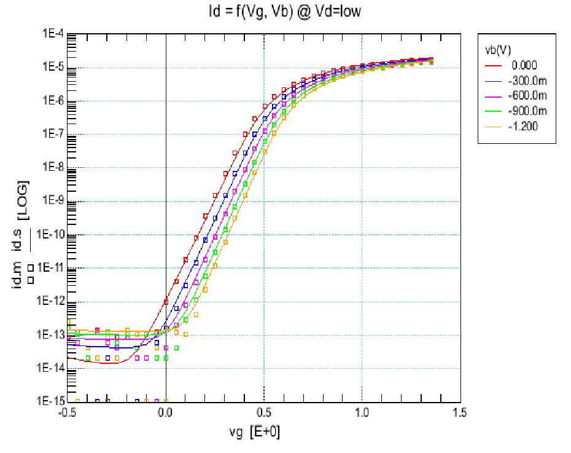
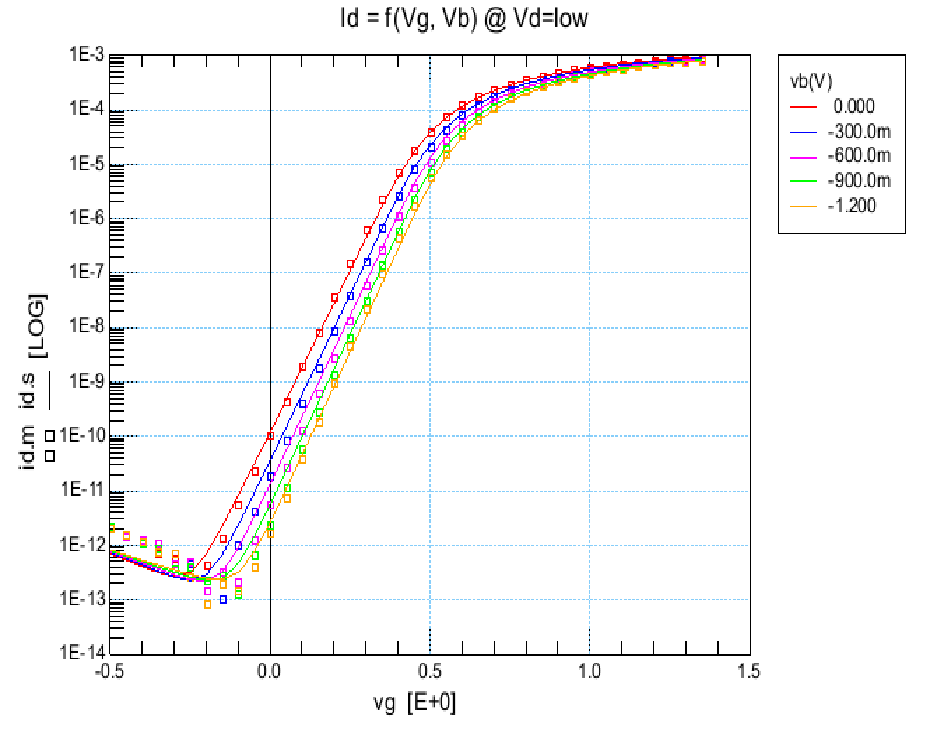
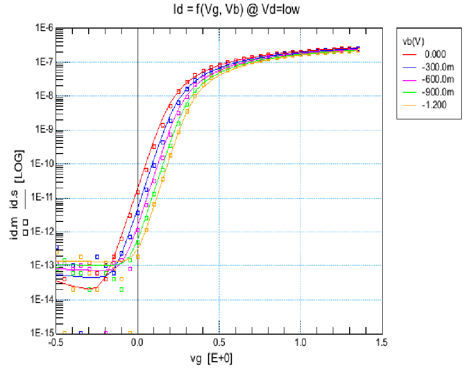
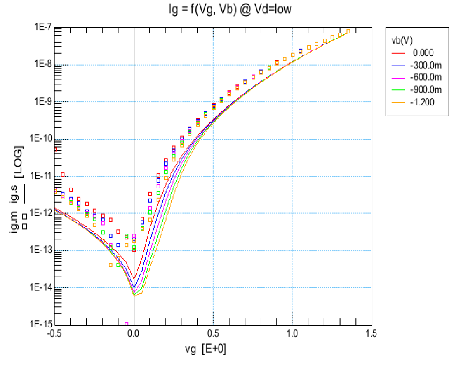
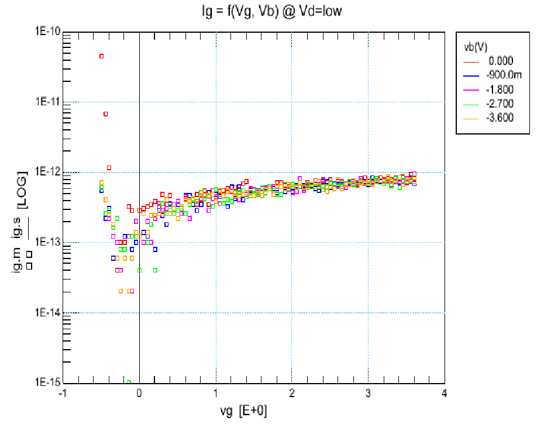

# Transistor characterization

As leakage currents will be of paramount importance in the trident chip, it is worth reproducing
the leakage measurements in a setup made specifically for it.

The plan is to use fully guarded test structure with no ESD protection, and measure
it under the same setup that was use to characterize previous chips (UTOPIA, ACCURATE) made by the HSE-RP-IL section.
It uses ultra-low current cable such as the internal pair of the SPA6 cable, the keithley 6430 and
an unpackaged chip bonded on a guarded PCB.

## Drain to source

As summarized in a previous [work (p.22)](https://repository.cern/records/crd5h-qnd33/preview/CERN-THESIS-2017-183.pdf) in the section, drain to source leakage for the technology of interest is likely to be dominated by the subthreshold leakage current.

The EKV model predicts that the subthreshold leakage should be proportional to W/L.
This is however not what seems to be the case:

Raising the width indeed seems to have a large impact, but the length does not seem to impact
the leakage current as expected, as the smaller length has also a smaller leakage.

## Gate leakage

The gate leakage is likely to be mostly impacted by the thickness of the gate oxide,
and by the perimeter of the gate.

The size does not seem to affect the HV NMOS transistors' gate leakage.
For the LV NMOS, bigger size seems to worsen overall leakage, but interestingly enough, does not seem to affect
it in the zero gate voltage vicinity.
