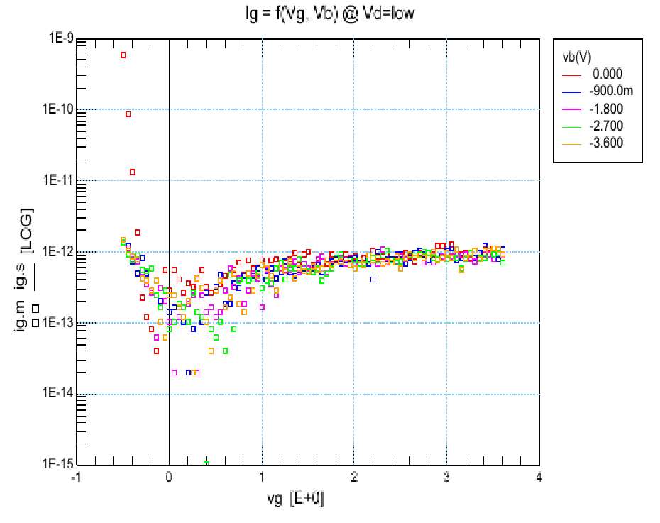
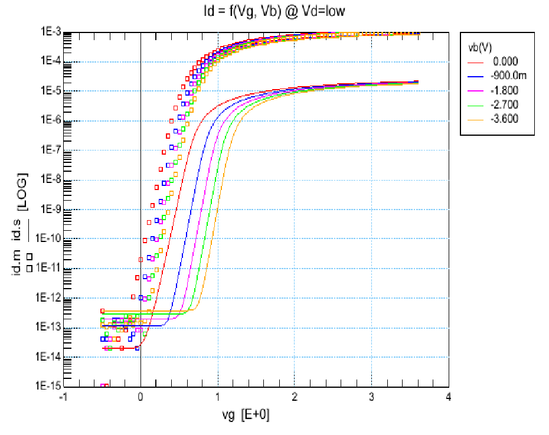
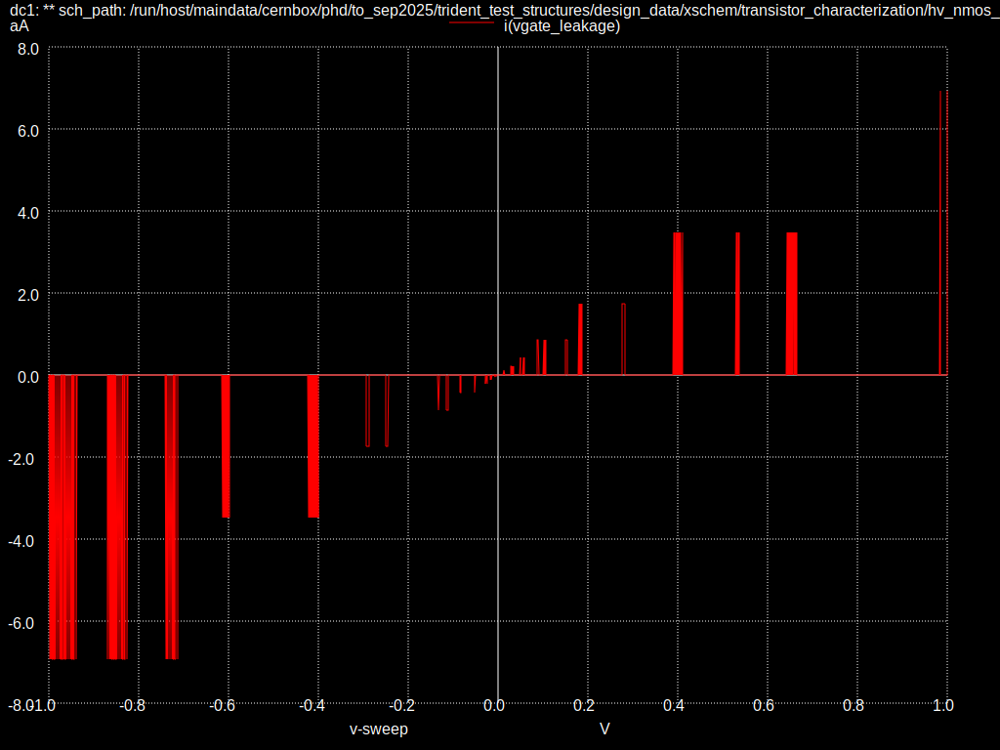

# HV NMOS minimum size W0u3_L0u45

## IHP Characterization

IHP has already made characterization for the minimum size HV NMOS.
The values of interest are the gate leakage and the drain to source leakage for Vd=0.1 and T=27°C

## SPICE Models

Provided spice models do not seem to take into account either the gate leakage.
The drain to source leakage in deep subthreshold regime shows large difference
to the measurements.

